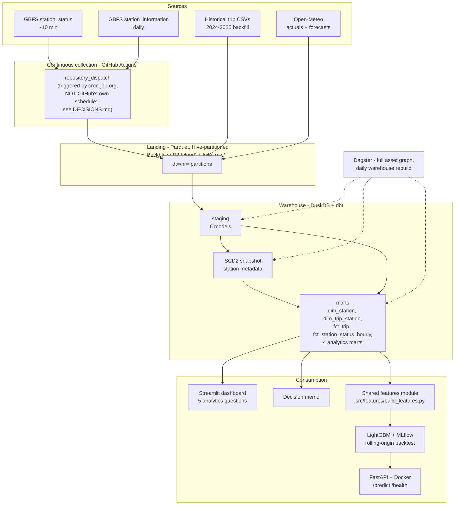

# Bike-Share Intelligence Platform — Capital Bikeshare (DC Metro)

A 7-week end-to-end data platform build: GBFS live feeds + historical trip
data + weather actuals/forecasts → dbt dimensional warehouse → Dagster
orchestration → dashboard + decision memo → a leakage-checked bike
availability model, served and monitored.

**City:** Capital Bikeshare (Washington, DC metro — DC, Arlington,
Alexandria, Montgomery Co., Prince George's Co., Fairfax, Falls Church).
Chosen over Divvy (Chicago) for deeper public trip history (2010+) and a
lighter station count. Full reasoning: `docs/city-selection.md`.

## Architecture



## Three entry points

**Hiring for data engineering? Start here:** idempotent ingestion
(`src/ingestion/`, proven by deleting/re-running partitions), SCD Type 2
snapshot (`dbt/snapshots/stations_snapshot.sql`, verified against a real
capacity change), the missing-crosswalk architecture fix (`dim_trip_station`
— see `docs/DECISIONS.md`), Dagster asset graph, CI.

**Hiring for analytics? Start here:** `docs/metrics.md` (precise metric
definitions), `dashboard/app.py` (all 5 analytics questions, real data),
`docs/decision-memo.md` (one recommendation, quantified, from real numbers).

**Hiring for ML? Start here:** `src/features/build_features.py` (leakage
prevention, proven with an adversarial test), `src/ml/train.py`
(rolling-origin backtest), `docs/model-card.md` (an honestly-reported
result — the model doesn't yet beat a simple baseline, and the model
card says so directly, with a real progression table tracking the
finding over time as more data accumulated).

## Cost

$0/month on free tiers: GitHub Actions (unlimited on a public repo),
Backblaze B2 (measured: ~300MB/month against a 10GB free allowance),
cron-job.org (free tier), DuckDB (embedded, no hosting cost). The only
thing that would ever cost money is a paid deployment host for the
serving API, which hasn't been done yet (see Week 6 status below).

## Quickstart

```bash
git clone <this-repo>
cd bikeshare-platform
pip install -e ".[dev]"
cp .env.example .env        # fill in your Backblaze B2 credentials if using cloud collection
pytest tests/ -v             # 52 tests should pass
python -m src.ingestion.poll_station_status   # one-shot poll of live station_status
```

For the dbt warehouse:
```bash
cd dbt
pip install dbt-core dbt-duckdb
# IMPORTANT: use an ABSOLUTE path, not a relative one. Staging models are
# dbt VIEWS, which re-run their read_parquet() call using whatever path
# was compiled in — a relative path like "../raw" resolves correctly
# only when queried from inside dbt/. Any script that later connects to
# bikeshare.duckdb from a DIFFERENT working directory (e.g. src/ml/train.py
# or dashboard/app.py, both run from the project root) would then resolve
# that relative path wrong and fail with "No files found". An absolute
# path avoids this entirely — see docs/DECISIONS.md for the full story.
DBT_PROFILES_DIR=. dbt build --vars "{\"raw_data_path\": \"$(pwd)/../raw\"}"
```

For the ML training pipeline (baselines + LightGBM, no extra installs needed
— duckdb/lightgbm/mlflow are already part of the base install above):
```bash
python -m src.ml.train
```

## Status

### Week 1 — Ingestion (complete)

Four independent data sources, each with retry/backoff, Pydantic
validation at the boundary, dead-letter routing for malformed payloads,
and Hive-partitioned Parquet output:

| Source | Script | Cadence |
|---|---|---|
| Live station bike/dock counts | `src/ingestion/poll_station_status.py` | ~10 min |
| Station metadata (name/capacity/lat-lon) | `src/ingestion/poll_station_information.py` | daily |
| Weather forecast (issue-timestamped) | `src/ingestion/archive_weather_forecast.py` | daily |
| Weather actuals (historical) | `src/ingestion/fetch_weather_actuals.py` | one-time backfill |
| Trip history (schema-drift-aware) | `src/ingestion/fetch_trip_history.py` | one-time backfill |

**Cloud collection:** GitHub Actions + Backblaze B2, triggered externally
by cron-job.org (not GitHub's own `schedule:` trigger — see
`docs/DECISIONS.md` for why). Runs continuously regardless of local time
zone or whether any personal machine is on. Setup: `docs/cloud-setup.md`.

Backfilled range: **2024-01 through 2025-12** (most recent complete
2-year window — spans a real pattern of record 2025 ridership followed
by a 2026 decline).

### Week 2 — dbt warehouse (complete)

- 5 staging models (station status, stations, trips, trip-derived
  stations, weather) — rename/cast/dedupe only, no business logic
- SCD Type 2 snapshot on station metadata (`snapshots/stations_snapshot.sql`)
  — verified against a real simulated capacity change
- 4 marts: `dim_station` (live, SCD2), `dim_trip_station` (derived from
  trip data — see below), `fct_trip` (incremental), `fct_station_status_hourly`
- 15 dbt tests (schema + singular), all passing or intentionally
  warning on documented, investigated findings

**Full build result on real data (~10M+ trips):** `PASS=21 WARN=4 ERROR=0`
— every warning is understood and documented, not a mystery. See
`docs/DECISIONS.md` for the full list of real issues found and how each
was resolved.

### Week 3 — Dagster + CI (complete)

- `dagster/bikeshare_dagster/` — 3 ingestion assets + the entire dbt DAG
  (staging, snapshot, marts) pulled into one asset graph via `dagster-dbt`
- One automatic schedule (daily dbt rebuild) — deliberately NOT scheduling
  ingestion again, since GitHub Actions already owns continuous collection
  (see `docs/DECISIONS.md` for why running both would be redundant)
- `.github/workflows/ci.yml` — lint + full test suite + a sample dbt build
  on every push

### Week 4 — Analytics dashboard + decision memo (complete)

- `docs/metrics.md` — precise definitions for every metric, including the
  invented "station empty-hours" KPI
- 4 new marts answering all 5 of the plan's analytics questions
  (member/casual patterns, weather elasticity, empty-hours, commute
  corridor asymmetry, capacity exceedance)
- `dashboard/app.py` — a real Streamlit dashboard covering all 5 questions
- `docs/decision-memo.md` — one recommendation (an evening rebalancing
  route for the National Mall monument corridor), backed by real numbers
  from the dashboard

### Week 5 — Baselines + ML model (complete)

- `src/features/build_features.py` — leakage-safe feature engineering
  (lags, rolling means, neighbor station state, cyclical time encodings,
  a weather-forecast join that only ever sees what was known at
  prediction time — proven with a deliberate adversarial test)
- `src/ml/baselines.py` — persistence, seasonal-naive, and station-hour-mean
- `src/ml/train.py` — LightGBM with a rolling-origin backtest (purge gap,
  not a random split), MLflow logging, adapts fold count honestly to
  however much real history actually exists
- `docs/model-card.md` — what the model does, how it was evaluated, and
  where it genuinely fails. **Current real result: the model does not yet
  beat the persistence baseline** (0.973 vs. 0.803 MAE, ~3 days of real
  history) — reported honestly, exactly as the plan expects this to
  sometimes happen
- Two real bugs found and fixed along the way — a relative-path gotcha and
  a serious timezone bug that was invisible in development and only
  surfaced on a non-UTC-timezone machine (both in `docs/DECISIONS.md`)

### Week 6 — Serving (in progress)

- `src/serving/api.py` — FastAPI app: `POST /predict` (station_id →
  prediction with a confidence interval, built from real held-out
  backtest residuals, not a made-up number) and `GET /health`
- `src/ml/train.py` now persists the trained model (`models/bikeshare_model.txt`)
  and metadata (`models/model_metadata.json`) instead of discarding it
  after every run
- `src/features/build_features.py` gained `get_latest_feature_row()` and
  the canonical `FEATURE_COLUMNS` list — the SAME feature code training
  uses, reused (not reimplemented) for serving, so the two can't drift apart
- Every prediction is logged (`models/prediction_log.parquet`) with every
  feature value used — this is what a later monitoring job needs to join
  against actuals once 60 minutes have elapsed
- Tested end-to-end with FastAPI's `TestClient` against a real trained
  model and real warehouse data — confirmed a genuine 200 response with
  a real prediction and a correctly-populated log row, not just that
  the code runs
- Found and fixed a real bug during testing: an empty/stale
  `station_status` result (data aged out of the freshness window)
  crashed with a raw 500 instead of a clean error
- `Dockerfile` written for deployment — **not yet verified**, no Docker
  available in the environment this was built in; needs testing on your
  machine before trusting it
- **Not yet done:** actual deployment to a public host (Fly.io/HF
  Spaces/Render), the "close the loop" monitoring job that joins logged
  predictions to actuals, Evidently drift reports, champion/challenger
  retraining

### Not started yet

- Week 7: polish, video, final README pass

## Repo layout

```
src/
  config.py                       # city config, poll interval — swap cities here only
  storage.py                      # optional B2 upload (no-op without credentials)
  ingestion/
    schemas.py                    # Pydantic models — GBFS + Open-Meteo boundary validation
    poll_station_status.py        # (1) live bike/dock counts
    poll_station_information.py   # (2) station metadata (feeds the SCD2 snapshot)
    archive_weather_forecast.py   # (3) daily forecast, issue-timestamped
    fetch_weather_actuals.py      # (4) historical weather backfill
    fetch_trip_history.py         # (5) historical trips - schema-drift + dtype-consistency handling
  features/
    build_features.py             # leakage-safe feature engineering, shared train/serve
  ml/
    baselines.py                  # persistence, seasonal-naive, station-hour-mean
    train.py                      # rolling-origin backtest + LightGBM + MLflow logging + model persistence
  serving/
    api.py                        # FastAPI: POST /predict, GET /health, prediction logging
  tools/
    download_from_b2.py           # pull accumulated cloud data down locally, on demand

models/                            # trained model + metadata + prediction log (gitignored, generated)

Dockerfile                         # for serving API deployment — untested, verify before trusting

dbt/
  models/staging/                 # 6 models - rename/cast/dedupe only
  models/marts/                   # 8 models - dims, facts, and Week 4's analytics marts
  models/schema.yml               # generic tests, with documented severity choices
  snapshots/stations_snapshot.sql # SCD Type 2
  tests/                          # 3 singular tests, all with documented severity

dagster/
  bikeshare_dagster/               # Dagster project: ingestion assets + full dbt DAG
  workspace.yaml

dashboard/
  app.py                          # Streamlit dashboard, all 5 Week 4 analytics questions

tests/                            # 52 Python tests, 8 test files, fixtures for every source
.github/workflows/
  poll-station-status.yml          # cloud collection (repository_dispatch triggered)
  archive-weather-forecast.yml     # cloud collection (repository_dispatch triggered)
  ci.yml                           # lint + tests + sample dbt build on every push
docs/
  city-selection.md               # Divvy vs Capital Bikeshare decision
  cloud-setup.md                  # B2 + cron-job.org setup guide
  DECISIONS.md                    # every real bug/finding hit, with root cause and fix
  metrics.md                      # precise definitions for every analytics metric
  decision-memo.md                # Week 4's recommendation, backed by real numbers
  model-card.md                   # Week 5's model — what it does, how it fails
raw/                               # data lands here locally when downloaded
```
